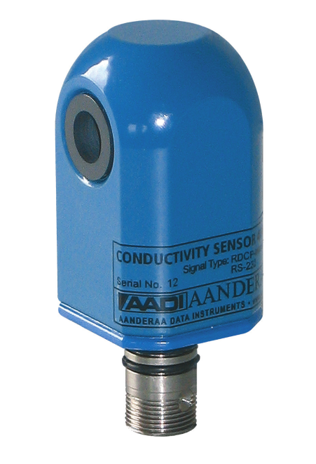

# PyCT4319

Python program for reading the conductivity sensor 4319 from Aanderaa, it was written to integrate the sensor with an embedded computing module.



## Conductivity Sensor 4319

Specific conductivity is a property that describes how well a material can conduct an electrical
current. For seawater this property is mostly dependent on the inorganic dissolved solids and the
temperature of the water.

Salinity is defined as the concentration of these dissolved solids, and by measuring both the
Conductivity and Temperature (the Conductivity sensor 4319 has a built-in Temperature sensor)
the salinity of the water can be determined.

Other important properties of seawater can be calculated based on the salinity measurements,
e.g. the density and the speed of sound.

For freshwater the conductivity can be used as a quality indicator. Increased conductivity of a
stream will often indicate increased pollution, and increased conductivity of groundwater might
indicate seawater intrusion.

The Conductivity Sensor 4319 is based on an inductive principle. This provides for stable
measurement without electrodes that are easily fouled in the field.

## Example

```
from sensor import CT4319

ct = CT4319()

ct.start_comm(port = "/dev/ttyUSB0", baudrate = 9600)

ct.set_outputdir(output_dir = "./data/")

while True:
    #read the sensor for 10 minute and calculates average
    ct.do_mean(dt=timedelta(minutes=10))
    
    #print the pandas dataframe with the averages
    print(ct.data_mean)
    
    #Export data to csv
    ct.to_csv(data_mean = True)
    
    #50 minutes between averages
    time.sleep(50*60)
```
